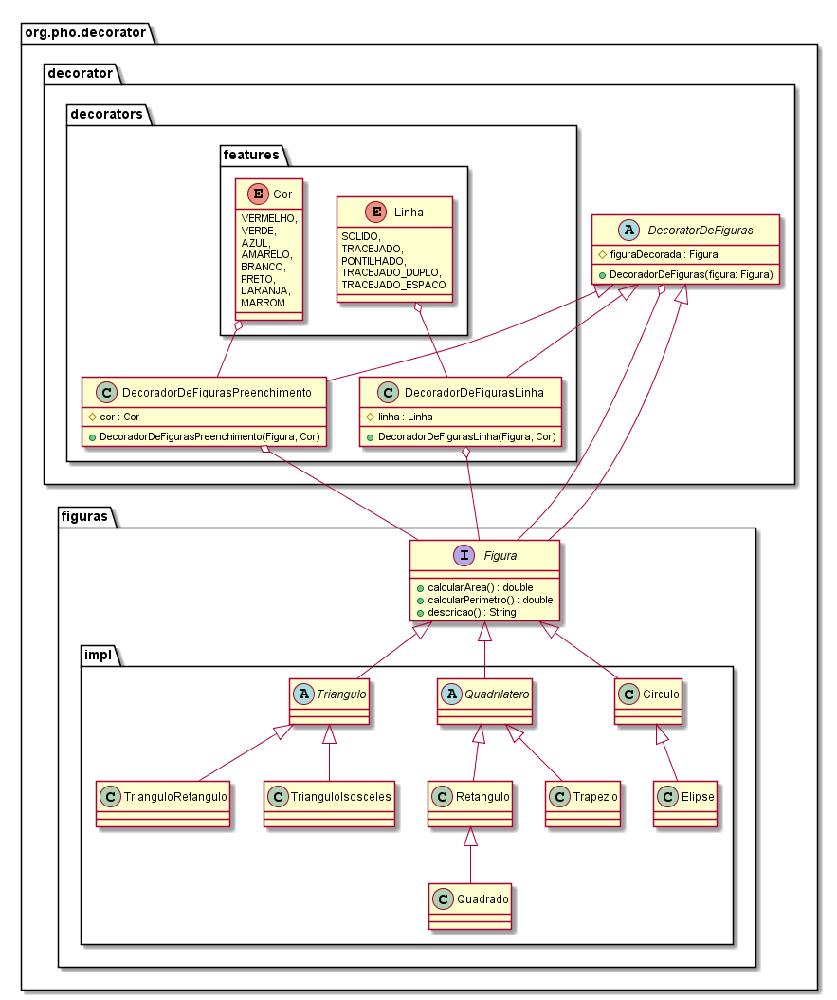

# Implementação do padrão de projetos Decorator

## Introdução

O padrão Decorator é um padrão de projetos comportamental que permite adicionar um comportamento à um objeto já existente, agregando dinamicamente responsabilidades adicionais à um objeto.

As principais propriedades dos padrões de projetos são:

* Capturar o conhecimento e a experiência de especialistas em projeto de software.
* Especificar abstrações que estão acima do nível de classes ou objetos isolados ou de componentes.
* Definir um vocabulário comum para a discussão de problemas e soluções de projeto.
* Facilitar a documentação e manutenção da arquitetura do software.
* Auxiliar o projeto de uma arquitetura com determinadas propriedades.
* Auxiliar o projeto de arquiteturas mais complexas.

## Diagrama

Segue o diagrama do padrão de projeto:



## Código PlantUML

Segue o código plantuml:

```
package org.pho.decorator {

    package core {
        abstract class DecoratorDeFiguras {
            # figuraDecorada : Figura
            + DecoradorDeFiguras(figura: Figura)
        }

        package decorators {

            class DecoradorDeFigurasPreenchimento {
                # cor : Cor
                + DecoradorDeFigurasPreenchimento(Figura, Cor)
            }

            class DecoradorDeFigurasLinha {
                # linha : Linha
                + DecoradorDeFigurasLinha(Figura, Cor)
            }

            package features {
                enum Cor {
                    VERMELHO,
                    VERDE,
                    AZUL,
                    AMARELO,
                    BRANCO,
                    PRETO,
                    LARANJA,
                    MARROM
                }

                enum Linha {
                    SOLIDO,
                    TRACEJADO,
                    PONTILHADO,
                    TRACEJADO_DUPLO,
                    TRACEJADO_ESPACO
                }
            }

            Cor o-- DecoradorDeFigurasPreenchimento
            Linha o-- DecoradorDeFigurasLinha

            DecoratorDeFiguras <|-- DecoradorDeFigurasPreenchimento
            DecoratorDeFiguras <|-- DecoradorDeFigurasLinha

        }

    }

    package figuras {

        interface Figura {
            + calcularArea() : double
            + calcularPerimetro() : double
            + descricao() : String
        }

        package impl {

            class Circulo
            class Elipse

            abstract class Quadrilatero
            class Retangulo
            class Quadrado
            class Trapezio

            abstract class Triangulo
            class TrianguloRetangulo
            class TrianguloIsosceles

            Figura <|-- Circulo
            Figura <|-- Quadrilatero
            Figura <|-- Triangulo

            Circulo <|-- Elipse

            Quadrilatero <|-- Retangulo
            Quadrilatero <|-- Trapezio
            Retangulo <|-- Quadrado

            Triangulo <|-- TrianguloRetangulo
            Triangulo <|-- TrianguloIsosceles
        }

    }

    DecoratorDeFiguras o-- Figura
    DecoratorDeFiguras <|-- Figura

    DecoradorDeFigurasPreenchimento o-- Figura
    DecoradorDeFigurasLinha o-- Figura
}
```

## Proposta

### Parte 1

Implementar o padrão de projeto utilizando somente classes concretas. Escrever um modelo de uso. Se desejar fazer a implementação utilizando TDD.

### Parte 2

Reimplementar o padrão de projetos obdecendo os tipos diferentes de classes (interface, classe abstrata).