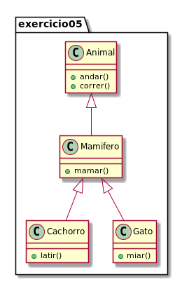
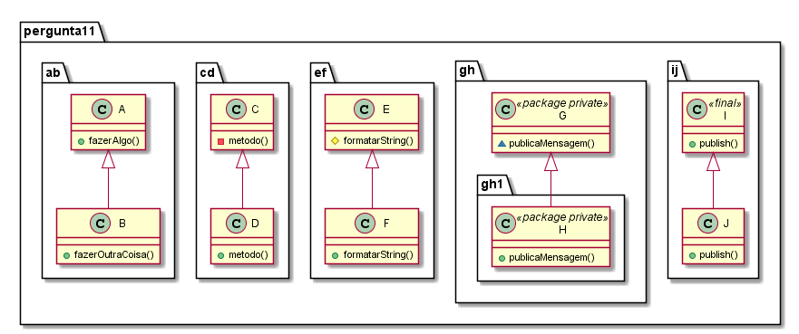

# Questionário Herança

## Orientação à Objetos

### 1. Qual relação é feita quando se fala de herança?
       
A) Tem-um
       
B) É-parte-de
      
C) n..m
       
D) É-um
       
E) Existe-um

### 2. Uma subclasse terá todos os métodos e atributos públicos de uma superclasse

A) VERDADEIRO

B) FALSO

### 3. Em uma subclasse: 

A) É possivel eliminar métodos

B) É possível eliminar atributos

C) É proibido adicionar métodos

D) é permitido adicionar atributos

E) Não é permitido nada

### 4. Na UML a herança múltipla é possível

A) VERDADEIRO

B) FALSO  

### 5. O que é verdadeiro sobre esse diagrama de classes? 

A) A classe `Mamifero` é subclasse de `Gato`

B) A classe `Cachorro` não mantém relação de herança entre nenhuma classe

C) A classe `Gato` é um `Animal`

D) A classe `Gato` é superclasse de `Cachorro`

E) A classe `Mamifero` possui uma relação de composição com as classes `Animal`, `Cachorro` e `Gato`

## Java

### 1. Qual a palavra chave para herança em Java?

A) `static`

B) `var`

C) `public`

D) `extends`

E) `::`

### 2. Qual a palavra chave acessa métodos e atributos de uma superclasse? 

A) `switch`

B) `this`

C) `self`

D) `private`

E) `super`

### 3. Qual operador permite verificar se uma classe é subclasse de outra?

A) `isA`

B) `instanceof`

C) `implements`

D) `extends`

E) `protected`

### 4. Em uma subclasse é possível acessar os métodos e atributos privados de uma superclasse utilizando o operador `super`.

A) VERDADEIRO

B) FALSO

### 5. Em uma subclasse é possível acessar os métodos e atributos protegidos de uma superclasse utilizando o operador `super`.

A) VERDADEIRO

B) FALSO

### 6. A anotação `@Override` denota que um método foi:

A) sobrescrito

B) sobrecarregado

C) marcado como obsoleto

D) impossibilitado de sobrescrita

E) marcado como estático

### 7. É possível herança múltipla em Java.

A) VERDADEIRO

B) FALSO

**O diagrama a seguir é para reponder as questões 8 à 10** 

### 8. Quantos atributos e métodos terá a classe Cruzeiro?

A) 3 - 1

B) 5 - 2

C) 0 - 5

D) 8 - 8

E) 7 - 13

### 9. Qual alternativa não compila? 

A) `cruzeiro instanceof Navio`

B) `cruzeiro instanceof Navegavel`

C) `cruzeiro instanceof Submarino`

D) `submarino instanceof NavioMilitar`

E) `submarino instanceof Object`

### 10. É possível reimplementar o método `atracar()` na classe submarino.

A) VERDADEIRO

B) FALSO  

### 11. No diagrama abaixo, qual é a alternativa correta?

A) pacote `ab`

B) pacote `cd`

C) pacote `ef`

D) pacote `gh`

E) pacote `ij`
